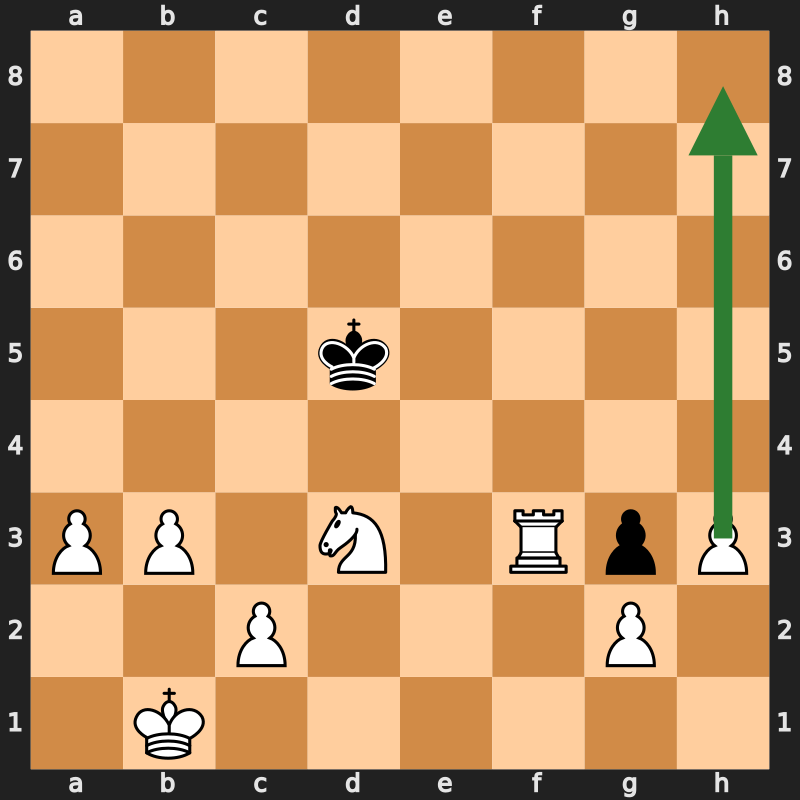
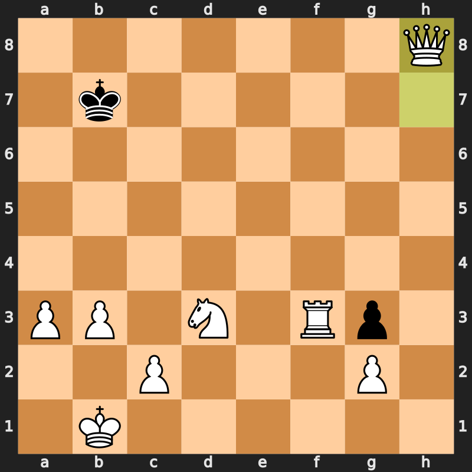

# Partieanalyse: WernerSchoegler (Weiß) vs. David-BOT (1400)

**Datum:** 8. Juli 2026
**Ergebnis:** 1–0, Matt in 57 Zügen
**ECO:** B00 (King's Pawn Opening)
**Link:** https://www.chess.com/de/analysis/game/computer/1713011958/review

---

## Partie (PGN)

```
1. e4 h5 2. d4 Nf6 3. Nc3 Nc6 4. Nf3 e6 5. Bg5 d5 6. e5 a5 7. exf6
gxf6 8. Bf4 Bh6 9. Qd2 Bxf4 10. Qxf4 Nb4 11. O-O-O Qd7 12. a3 Qd6
13. Qxd6 cxd6 14. Kb1 Nc6 15. Nb5 e5 16. Nxd6+ Ke7 17. Nb5 e4 18.
Nd2 Bg4 19. f3 Rhc8 20. fxg4 hxg4 21. Be2 g3 22. h3 Rab8 23. Nc3
Rd8 24. Nb5 f5 25. Nb3 a4 26. Nc5 Re8 27. Nxa4 e3 28. Nc7 Rec8
29. Nxd5+ Ke6 30. Ndb6 Rd8 31. Bc4+ Kf6 32. d5 Ne7 33. Nc3 Rd6
34. Nba4 Rc8 35. b3 Re8 36. Rhf1 Rg8 37. Ne4+ Ke5 38. Nxd6 Kxd6
39. Rde1 f4 40. Rxf4 Ke5 41. Rxf7 Nxd5 42. Bxd5 Kxd5 43. Rxe3 b6
44. Nxb6+ Kc5 45. Nc4 Rg5 46. Re5+ Rxe5 47. Nxe5 Kd5 48. Nd3 Kd4
49. Rf3 Kd5 50. h4 Kc6 51. h5 Kb7 52. h6 Kc6 53. h7 Kb7 54. h8=Q
Ka7 55. Rf6 Kb7 56. Qh7+ Kc8 57. Rf8# 1-0
```

---

## Eröffnung (1–10)

| Zug | Kommentar |
|---|---|
| 1...h5?! | Ungewöhnlich, schwächt Königsflügel früh |
| 3.Nc3?! | Inaccuracy — Nf3 zuerst hätte mehr Optionen offengehalten |
| 3...Nc6?? | Blunder — blockiert eigenen c-Bauern |
| 5.Bg5?! | Inaccuracy — verfrühte Fesselung |
| 5...d5?? | Blunder |
| **6.e5!** | Bester Zug der Eröffnung — Raumgewinn, greift Sf6 an |

**Wichtig:** Anders als in den vorherigen zwei Partien zeigt diese Partie auch **eigene Ungenauigkeiten** (3.Nc3?!, 5.Bg5?!) — nützliches Kalibrierungssignal, dass die Genauigkeit in der Eröffnungsphase noch ausbaufähig ist.

---

## Mittelspiel (11–20)

- **11.O-O-O** — solide Rochade, Turm aktiviert Richtung d-Linie
- **11...Qd7?? 12.a3 Qd6 13.Qxd6 cxd6** — Schwarz-Fehler ermöglicht günstigen Damentausch
- **15.Nb5 e5? 16.Nxd6+** — sauberer Springer-Einbruch, gewinnt Bauer und zerstört schwarze Königsstellung dauerhaft

---

## Lange Manöverphase (17–38)

Ausgedehnte Springerreise (Nb5–d6–b5–d2, später Na4–c5–a4–c3–a4) — eher indirekt, nicht der effizienteste Weg, aber am Ende zielführend. Schwarz gibt in dieser Phase wiederholt Tempo und Material zurück (36...Rg8?, 39...f4?, 41...Nxd5??), ohne dass Weiß unter Druck geraten wäre.

---

## Endspielverwertung (39–57)

| Phase | Bewertung |
|---|---|
| 41.Rxf7 | Weiterer Bauerngewinn |
| 42.Bxd5 Kxd5 43.Rxe3 | Saubere Materialabräumung |
| 47.Nxe5 | Vereinfachung zu gewonnenem T+S-Endspiel |
| 50–54. h4-h5-h6-h7-h8=Q | **Lehrbuchmäßige Freibauer-Umwandlung** — keine verschwendeten Züge |
| 57.Rf8# | Dame+Turm-Zusammenspiel, korrekt berechnetes Matt |

### Diagramm 1 — Stellung vor dem Bauernmarsch (nach 49...Kd5)



Weißer König auf b1, Turm f3, Springer d3, freier Bauer auf h3. Schwarz hat nur König und einen wertlosen g3-Bauern. Der Pfeil zeigt den geplanten Weg des h-Bauern bis zur Umwandlung auf h8.

### Diagramm 2 — Stellung nach der Umwandlung (54.h8=Q)



Der neue Damengewinn entscheidet die Partie endgültig. Drei Züge später folgt 57.Rf8#.

---

## Vergleich über die drei bisher analysierten Partien

| Fähigkeit | Partie 1 (King's Gambit) | Partie 2 (Rd6+ Kombination) | Partie 3 (diese Partie) |
|---|---|---|---|
| Gegnerfehler bestrafen | ✓ | ✓ | ✓ |
| Eigene Initiative/Kombination | – | ✓ (27.Rd6+) | ✓ (6.e5!, 15.Nb5-d6+) |
| Eigene Ungenauigkeiten sichtbar | nicht markiert | nicht markiert | **ja (3.Nc3?!, 5.Bg5?!)** |
| Endspieltechnik | kurz | kurz | **lang, sauber (≈20 Züge Technik)** |

---

## Gesamteinschätzung

**Aktuelle Schätzung: ca. 950–1100 Elo**

- Die Endspieltechnik (Freibauer-Umwandlung, Turm+Springer-Koordination, geduldige Verwertung über ~20 Züge ohne Fehler) ist ein solides positives Signal.
- Die eigenen markierten Ungenauigkeiten zeigen, dass die Berechnung gut ist, in der Eröffnungs-/Planpräzision aber noch Potenzial besteht.
- Es fehlt weiterhin ein Datenpunkt, in dem eine schlechtere oder ausgeglichene Stellung verteidigt werden musste — alle drei Partien waren spätestens ab Zug 15–20 klar besser.

**Für eine engere Kalibrierung:** weitere Partien, idealerweise mit mindestens einer schwierigeren Verteidigungssituation.
